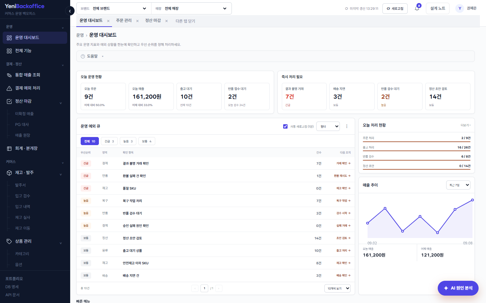
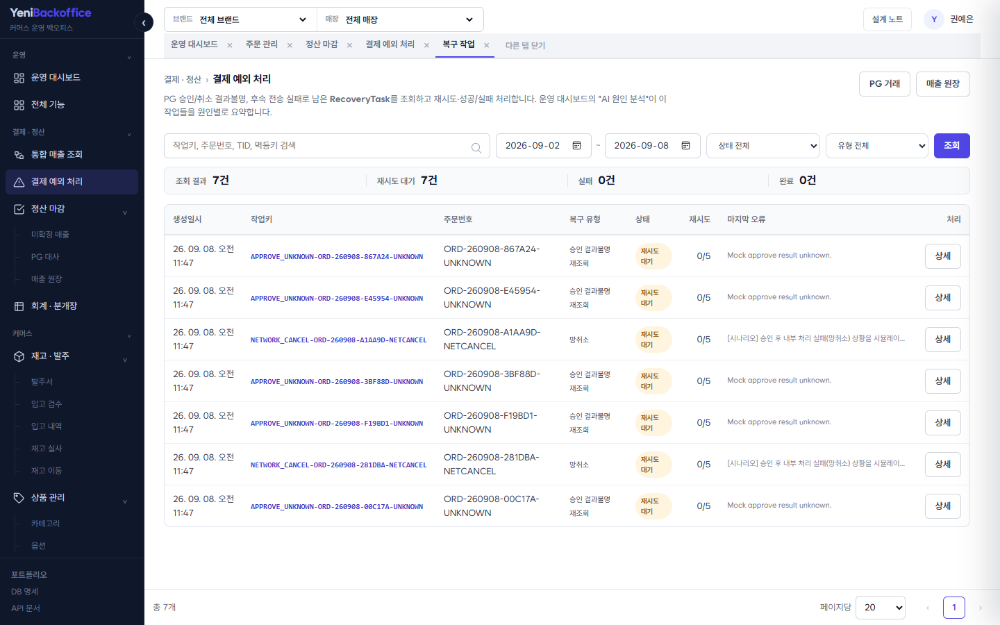
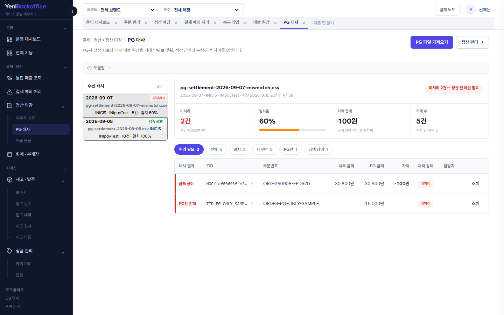
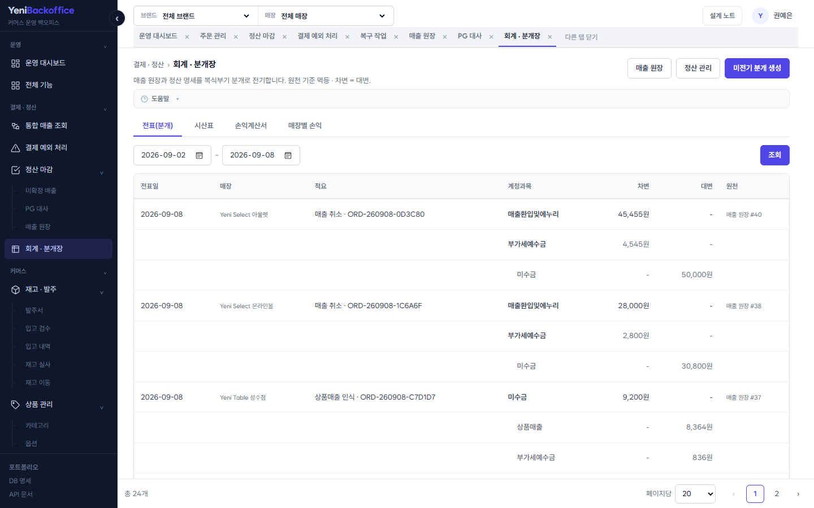

# Yeni Backoffice
커머스 주문·결제·매출·정산·재고를 각각 별도 상태로 추적하고, 화면마다 "지금 확인할 예외"와
"다음 작업"을 함께 보여주는 운영 백오피스입니다.

- **데모** — https://yeni-demo.fly.dev/
- **구현 노트** — [docs/implementation-notes.md](docs/implementation-notes.md)
- **API 문서** — 데모의 `/swagger-ui/index.html`

> 실제 PG 운영망에는 연결하지 않고 `MockPaymentGateway`로 승인·실패·결과불명·망취소를 재현합니다.
> 데모는 무료 호스팅이라 유휴 상태에서 첫 접속이 느릴 수 있습니다.



---

## 왜 만들었나

크로스보더 커머스사에서 100여 개 해외 쇼핑몰의 주문·결제·정산을, 결제·POS 솔루션사에서
POS/KIOSK 운영 백오피스와 매출·SAP 연동을 담당했습니다. 그때 담당 범위를 넘어 더 깊게 다뤄보고 싶었던
문제 — 결제 결과불명 처리, 중복 요청과 동시성, 외부 연동 실패 복구, 매출 원장과 정산의 연결 —
을 Java / Spring으로 다시 설계하고 검증한 개인 프로젝트입니다. 설계·구현·테스트·배포를 단독으로 했습니다.

## 기술 스택

| 구분 | 내용 |
|---|---|
| Backend | Java 17, Spring Boot 3.5, Spring MVC, Spring Data JPA |
| DB | PostgreSQL (운영/로컬), H2 (테스트) · 스키마는 Flyway 마이그레이션 |
| Frontend | Thymeleaf, htmx, Vanilla JS (SPA 아님) |
| Build | Gradle 멀티모듈 (`api`, `core`) |
| Test | JUnit 5, Spring Boot Test, MockMvc, Playwright (e2e) |
| 배포 | Docker, fly.io |

## 구조

```
api   View/REST 컨트롤러, Thymeleaf, 정적 리소스, 표준 오류 응답
core  도메인 Entity/Repository/Service, 상태 전이, Mock PG
```

```
Operator ──HTTP/JSON──▶ api ──use case──▶ core ──JPA──▶ PostgreSQL
                                            └──Gateway──▶ Mock PG / 알림톡
```

결제 승인·매출 확정 같은 핵심 업무 규칙은 `core`에 두고, 화면·REST·외부 전송은 `api`에서
처리합니다. 실패할 수 있는 외부 시스템은 핵심 트랜잭션과 분리하고, 결과를 확정할 수 없는
경우 재조회·재처리가 가능하도록 상태를 남깁니다.

## 설계에서 신경 쓴 것

### 1. '결과불명'을 운영 상태로

PG 승인 요청 중 timeout·응답 유실이 나면 실제 승인 여부를 즉시 확정할 수 없습니다. 실패로
단정하면 승인된 결제를 취소할 수 있고, 성공으로 처리하면 미결제 주문이 진행됩니다. 그래서
`APPROVE_UNKNOWN` / `CANCEL_UNKNOWN` 상태와 `PaymentRecoveryTask`를 두고, **결과 확정
전에는 매출 원장·정산·후속 처리를 만들지 않습니다.** 재조회가 반복돼도 원장과 후속 Queue가
중복 생성되지 않도록 unique 제약으로 막고, 복구 작업은 조건부 claim으로 중복 실행을 방지합니다.
→ [구현 노트 §6](docs/implementation-notes.md)



### 2. 중복 요청과 동시 부분취소

승인·취소는 중복 클릭·네트워크 재시도로 반복될 수 있고, 승인금액 10,000원에 8,000원 부분취소
2건이 동시에 들어오면 각각 이전 취소금액 기준으로 판단해 승인금액을 초과할 수 있습니다.

- 중복 요청 — `idempotencyKey` / `cancelRequestKey`로 기존 결과를 먼저 조회, DB unique 제약으로 최종 방어
- 동시 부분취소 — 대상 결제 row를 `PESSIMISTIC_WRITE`로 잠근 뒤 최신 누적 취소금액으로 잔액을 재계산해 검증

→ [구현 노트 §4·§5](docs/implementation-notes.md)

### 3. 매출 원장 → 정산 → 회계 분리

결제 상태만 바꾸는 방식으로는 특정 시점의 매출과 취소 이력을 정확히 재구성하기 어렵습니다.

- 승인(SALE)/취소(CANCEL)를 수정하지 않고 별도 불변 행으로 누적. CANCEL은 원 SALE ID를 참조
- 정산은 `payment_transaction`이 아니라 SALE/CANCEL 원장을 기준으로 집계. `DRAFT → CONFIRMED → PAID` 전이
- PG 대사 — 외부 정산 CSV와 내부 원장을 거래 단위로 비교(누락/외부단독/금액차이). 미처리 건이 남으면 정산 확정을 막음
- 회계 — 원장과 지급 완료 정산 명세를 소스로 복식부기 분개를 전기하는 프로젝션. `source_type + source_id` unique로 멱등, 스케줄러가 매일 자동 전기

→ [구현 노트 §8·§9·§16](docs/implementation-notes.md)

| PG 대사 | 회계 · 분개장 |
|---|---|
|  |  |

## 화면

운영 대시보드가 결과불명·복구 대기·안전재고 미달·정산 초안을 한 큐로 모으고, 각 업무 화면은
목록이 아니라 "지금 처리할 것"을 먼저 보여줍니다.

| 영역 | 화면 |
|---|---|
| 운영 | 대시보드, 통합 매출 조회, 운영 분석, 데이터 분석(Power BI) |
| 결제·정산 | 결제 예외 처리, PG 대사, 매출 원장, 정산 관리, 회계·분개장 |
| 커머스 | 주문, 상품/옵션/카테고리, 발주→입고 검수, 재고 원장, 재고 실사 |
| 기준정보 | 매장, 공급처, POS 단말 |

전체 화면 목록과 URL은 데모의 `/admin/all-features`에서 볼 수 있습니다.

## Power BI 연동

운영 대시보드가 "지금 처리할 운영 이슈"라면, `데이터 분석`(`/admin/data-analysis`)은 기간·상품·
카테고리 단위 집계를 Power BI로 분석하는 리포트 영역입니다. Power BI가 운영 DB에 직접 붙지 않도록
**조회 전용 BI API**(`/api/bi/**`)를 두고, 집계는 애플리케이션이 아니라 SQL(`GROUP BY`/`SUM`)에서
끝냅니다. 운영 API(`/admin/api/**`)와는 컨트롤러·서비스·쿼리 계층이 분리돼 있습니다.

| Endpoint | 내용 | query |
|---|---|---|
| `GET /api/bi/sales/daily` | 일자별 순매출·주문 건수·객단가 | `from` `to` `category` `channel` |
| `GET /api/bi/sales/products` | 상품별 매출·수량·취소 | `from` `to` `category` `channel` |
| `GET /api/bi/sales/stores` | 판매채널(온라인/매장)별 매출 | `from` `to` `category` |
| `GET /api/bi/inventory/status` | 상품 단위 가용·안전재고, LOT 유효기간 | `category` |
| `GET /api/bi/payment/status` | 결제 상태별 건수·금액, 결과불명(APPROVE_UNKNOWN 등) 수 | `from` `to` `channel` |

- 매출은 `sales_transaction_line`(SALE/CANCEL 원장의 상품 단위 분해)을 기준으로 집계합니다. CANCEL 라인 금액이 음수라 `SUM(line_amount)`이 곧 순매출입니다.
- 페이지네이션 없이 집계 결과를 반환하되, 조회 기간은 최대 366일로 제한합니다(`BiFilter`).

**Power BI Desktop에서 연결** — 가져오기 → 웹 → URL에 엔드포인트 입력
(예: `https://yeni-demo.fly.dev/api/bi/sales/daily?from=2026-01-01&to=2026-12-31`) →
반환된 JSON을 테이블로 변환. 5개 쿼리를 각각 불러와 리포트(Retail Sales & Inventory Analysis)를 구성합니다.
리포트를 publish-to-web으로 게시한 뒤 `BI_REPORT_EMBED_URL` 환경변수에 embed URL을 넣으면
`데이터 분석` 화면에 iframe으로 표시됩니다(미설정 시 placeholder).

## 테스트로 확인한 것

- 중복 승인/취소 시 기존 결과 반환, 동시 부분취소가 승인금액을 넘지 않음
- 승인 결과불명 시 SALE 미생성 + RecoveryTask 생성, 재조회 후 1회만 원장 생성
- 재고 원장 정합성 — 전역 수량 = 매장 재고 합계, 옵션 SKU 재고 예약
- 발주→입고, 재고 실사 조정이 재고·LOT·트랜잭션에 반영
- 같은 정산일·MID 중복 배치 방어, 동일 소스 재전기 시 분개 중복 없음
- 표준 `ErrorResponse` (`requestId` / `fieldErrors`)
- BI API — flat 배열·숫자 금액·실제 결제상태 enum 반환, 조회기간 366일 제한, 채널 차원은 실제 데이터 기준
- Playwright — 상품·입고·출고·반품·정산까지 이어지는 운영 워크플로

## 실행

```bash
# 빠르게 — H2 인메모리 (Postgres 불필요)
./gradlew :api:bootRun            # profile = test,demo → http://localhost:8080/

# 운영과 동일하게 — PostgreSQL + Flyway
docker compose up -d              # 로컬 postgres:16
./gradlew :api:bootRun --args='--spring.profiles.active=local,demo'
```

Windows는 `gradlew.bat`. 데모 시드 데이터는 `demo` / `fly` 프로파일에서만 채웁니다.
스키마는 `api/src/main/resources/db/migration/V*.sql` (Flyway)에서 관리하며, Postgres 프로파일은
`ddl-auto=validate`라 엔티티와 마이그레이션이 어긋나면 기동에 실패합니다. 배포 관련 상세는
[구현 노트](docs/implementation-notes.md)에 있습니다.

## 범위 밖 (운영 적용 전 보강)

- 인증/권한, CSRF/CORS, 감사 로그 정책
- 실제 PG callback signature 검증, 외부 알림 연동
- 동시성 통합 테스트를 Testcontainers(실 Postgres)로 전환 — 현재는 H2(PostgreSQL 호환 모드)
- 동적 필터 쿼리를 `Specification`으로 전환 (현재는 `preferQueryMode=simple`로 우회)
- RecoveryTask 자동 재처리 Worker, 정산 후 취소 자동 차감, 영업일 기준 D+N 정산
- 대량 데이터 성능 검증
